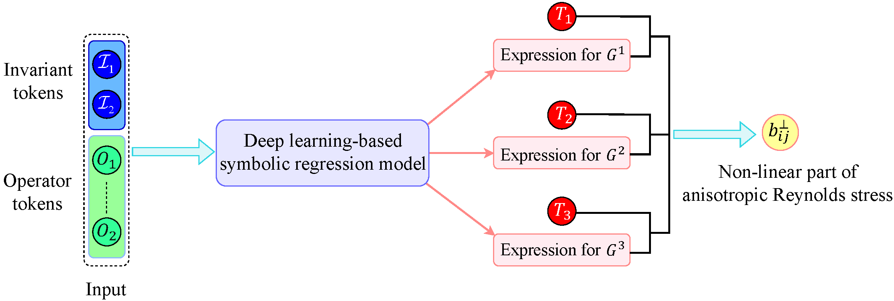
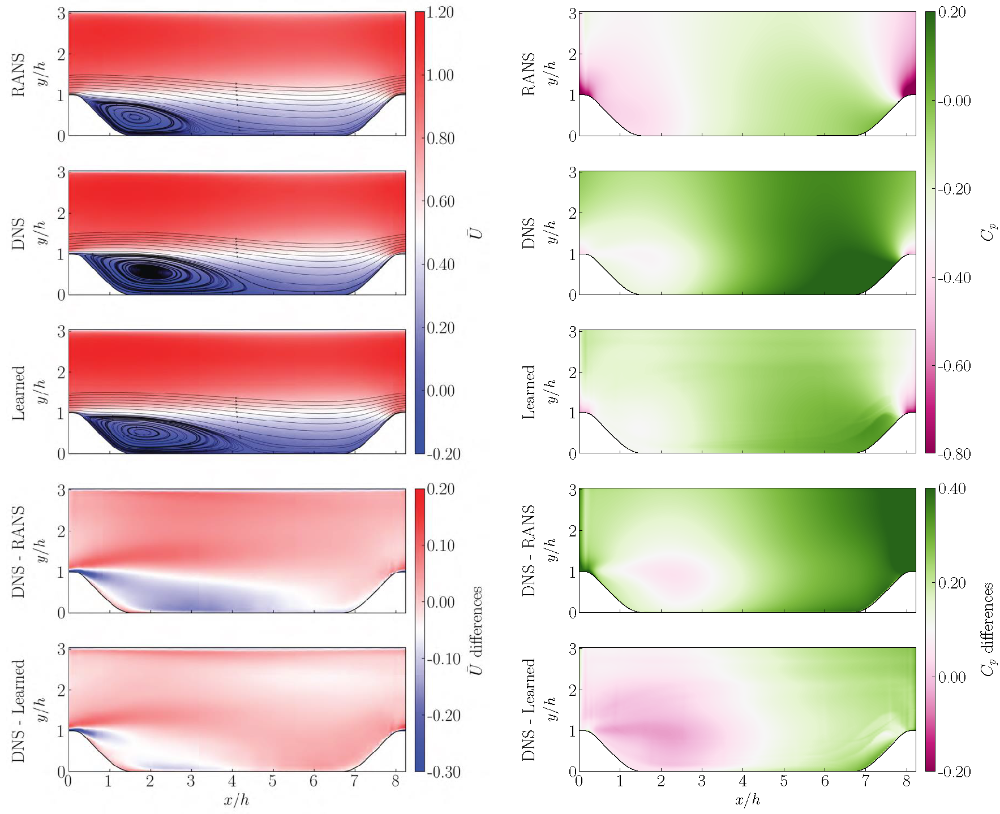

# DSRRANS

This work introduces a novel data-driven framework to formulate explicit algebraic Reynolds-averaged Navier-Stokes
(RANS) turbulence closures. Recent years have witnessed a blossom in applying machine learning (ML) methods to
revolutionize the paradigm of turbulence modeling. However, due to the black-box essence of most ML methods, it is
currently hard to extract interpretable information and knowledge from data-driven models. To address this critical
limitation, this work leverages deep learning with symbolic regression methods to discover hidden governing equations of
Reynolds stress models. Specifically, the Reynolds stress tensor is decomposed into linear and non-linear parts. While
the linear part is taken as the regular linear eddy viscosity model, a long short-term memory neural network is employed
to generate symbolic terms on which tractable mathematical expressions for the non-linear counterpart are built. A novel
reinforcement learning algorithm is employed to train the neural network to produce best-fitted symbolic expressions.
Within the proposed framework, the Reynolds stress closure is explicitly expressed in algebraic forms, thus allowing for
direct functional inference. On the other hand, the Galilean and rotational invariance are craftily respected by
constructing the training feature space with independent invariants and tensor basis functions. The performance of the
present methodology is validated through numerical simulations of three different canonical flows that deviate in
geometrical configurations. The results demonstrate promising accuracy improvements over traditional RANS models,
showing the generalization ability of the proposed method. Moreover, with the given explicit model equations, it can be
easier to interpret the influence of input features on generated models.

This paper is availbale at https://aip.scitation.org/doi/10.1063/5.0135638, the preprint is also available [here](https://www.researchgate.net/publication/367303532_Discovering_explicit_Reynolds-averaged_turbulence_closures_for_turbulent_separated_flows_through_deep_learning-based_symbolic_regression_with_non-linear_corrections)

The framework utilized in the present work for formulating explicit algebraic turbulence model is shown as follow:



It is shown that the discovered model can improve the RANS predictions:



# Installation

### Install dso package

To install all dependencies for performing training, run `pip install -e ./dso[all]` (please refer to [dso repo](https://github.com/brendenpetersen/deep-symbolic-optimization) for installation details).


### Install OpenFOAM package

To install turbulence model module, run `wclean && wmake` in `TurbulenceModels` folder.

# Getting started

### Run the training

To start a training, run `python -m dso.run dsoTurbulenceConfig.json` in `dso/dso`. Change the [dataset path](https://github.com/thw1021/DSRRANS/blob/d35a2d2bf1ffc338d8334b8f2963258e5f40f737/dso/dso/task/regression/regression.py#L494-L498) to use your own data.

### Run the simulation

You can use the [`runSimulation.sh`](https://github.com/thw1021/DSRRANS/blob/main/turbulenceCases/testing/runSimulation.sh) script to start the simulation after finishing the compilation of turbulence model.

### Configuring runs

Please refer to [dso repo](https://github.com/brendenpetersen/deep-symbolic-optimization) for the meaning of training parameters.

# Help

If you encounter problems, feel free to open an issue. You can also send an email to me (thw1021@nuaa.edu.cn, Hongwei Tang).


If you find this work useful for your research, please consider citing our work:
```
@article{doi:10.1063/5.0135638,
author = {Tang,Hongwei  and Wang,Yan  and Wang,Tongguang  and Tian,Linlin },
title = {Discovering explicit Reynolds-averaged turbulence closures for turbulent separated flows through deep learning-based symbolic regression with non-linear corrections},
journal = {Physics of Fluids},
volume = {0},
number = {ja},
pages = {null},
year = {0},
doi = {10.1063/5.0135638},
URL = {https://doi.org/10.1063/5.0135638},
eprint = {https://doi.org/10.1063/5.0135638}
}
```
